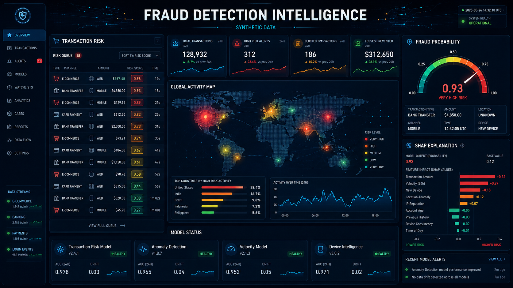
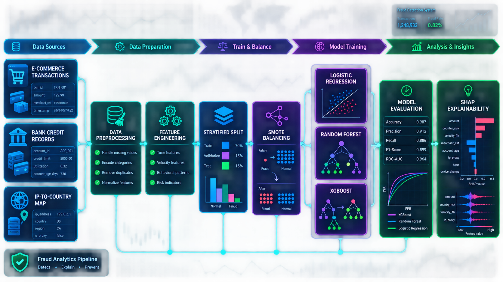
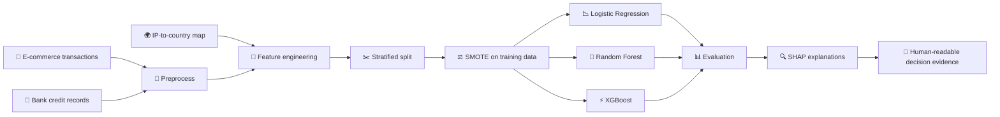
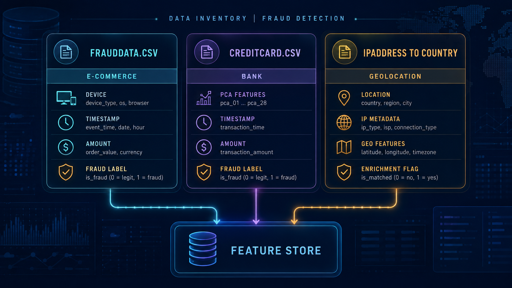
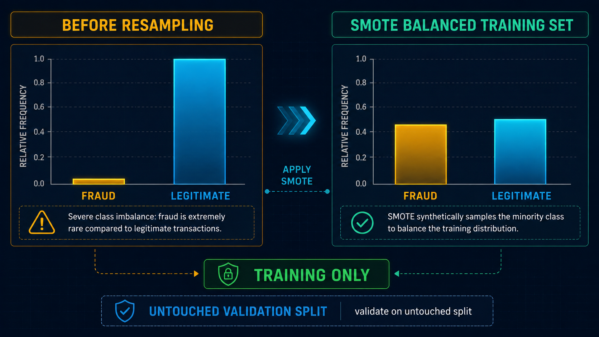
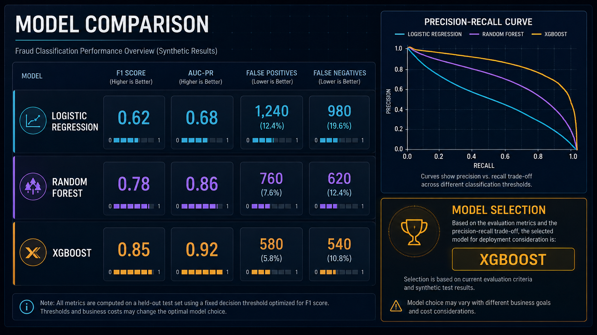
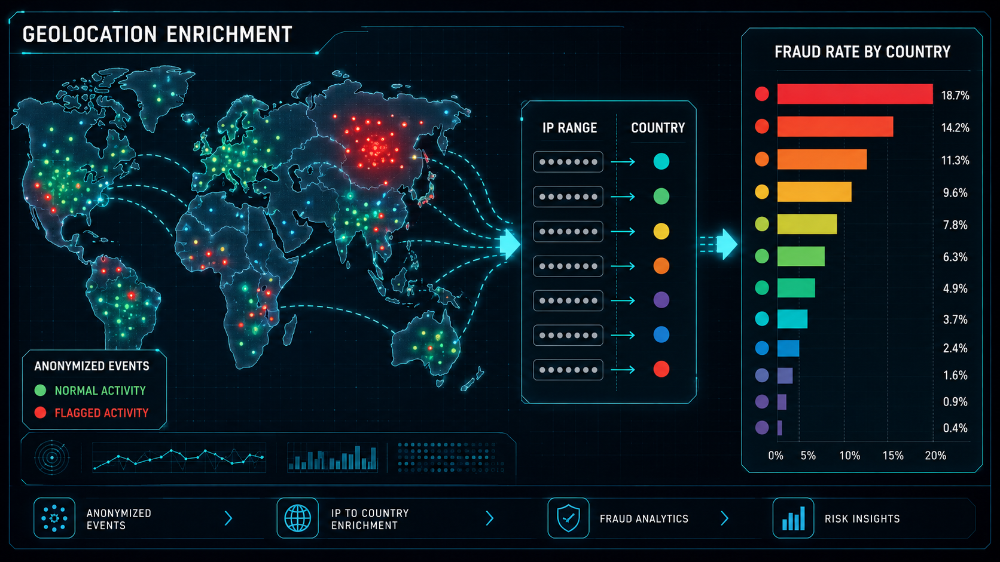
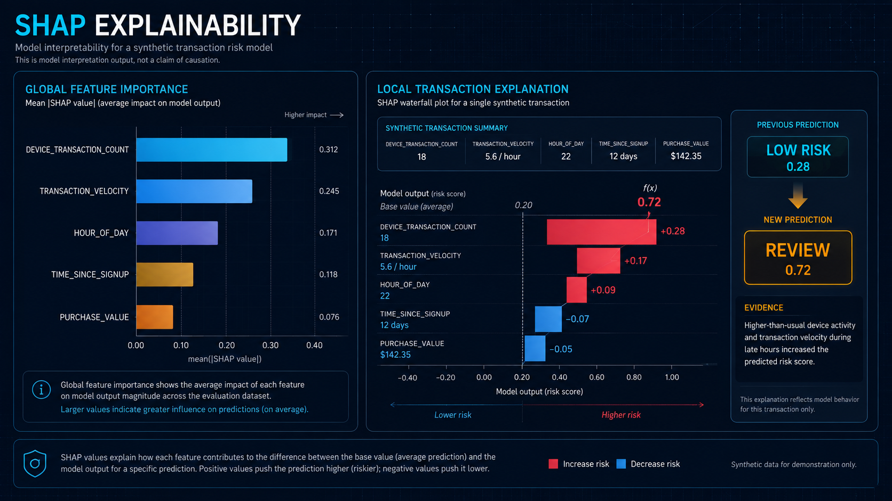
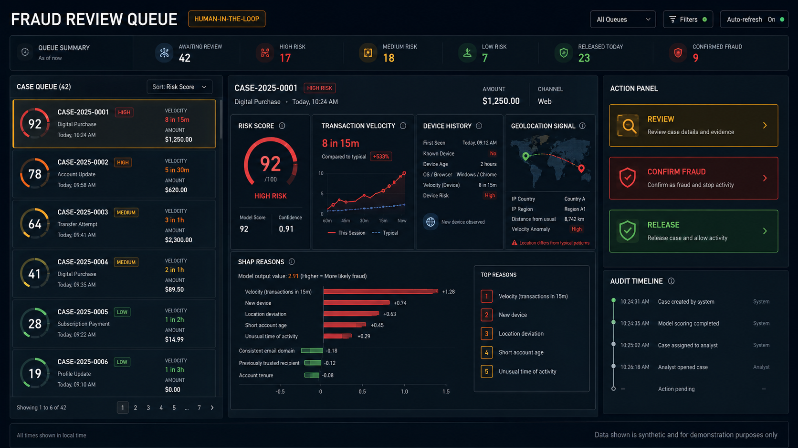

<div align="center">



# 🛡️ Fraud Detection Intelligence

### Explainable machine learning for e-commerce and bank-transaction risk

**Preprocessing · Transaction velocity · Geolocation enrichment · Imbalance-aware training · SHAP explanations**

[](https://www.python.org/)
[](https://scikit-learn.org/)
[](https://shap.readthedocs.io/)
[](https://dvc.org/)
[](https://pre-commit.com/)
[](LICENSE.md)

[Overview](#-overview) · [Pipeline](#-detection-pipeline) · [Visuals](#-visual-product-tour) · [Setup](#-local-setup) · [Results](#-benchmark-snapshot) · [Explainability](#-shap-explainability)

</div>

> [!IMPORTANT]
> This is a research and portfolio project using anonymized or synthetic-style datasets and historical benchmark snapshots. It is not a production banking decision system. Never use the outputs for automated financial decisions without domain validation, fairness review, security controls, monitoring, and human oversight.

## 🌐 Overview

**Fraud Detection Intelligence** studies how transaction metadata, behavior over time, and IP-to-country enrichment can improve fraud classification while keeping model decisions inspectable. The workflow covers both e-commerce purchases and anonymized bank-credit records, with separate preprocessing paths that converge on comparable model evaluation and SHAP explanations.

The core design principle is simple: a useful fraud model must balance detection power with customer experience. False negatives create financial exposure; false positives interrupt legitimate users. The project therefore tracks precision-recall behavior, class imbalance, feature leakage risks, and local explanations instead of relying on accuracy alone.

### ✨ At a glance

| Area | What this project demonstrates |
|---|---|
| Data preparation | Type-safe cleaning, missing-value handling, joins, and reproducible splits |
| Behavioral signals | User/device frequency, transaction velocity, time-of-day, weekday, and signup-age features |
| Geolocation | Integer-safe IP enrichment through an IP-range-to-country mapping |
| Imbalance strategy | SMOTE applied to an encoded training representation, with untouched validation data |
| Models | Logistic Regression, Random Forest, and XGBoost baselines/ensembles |
| Evaluation | F1-score, AUC-PR, confusion matrices, and precision-recall curves |
| Explainability | Global SHAP feature importance and local force/waterfall explanations |
| Reproducibility | Notebook sequence, scripts, DVC hooks, tests, pre-commit checks, and CI |

## 🚀 Key capabilities

- 🧼 **Modular preprocessing** for both transaction families.
- ⏱️ **Time and velocity features** that represent how activity changes across users, devices, and time windows.
- 🌍 **Geolocation enrichment** from IP-range mappings without placing raw IP values into reports.
- ⚖️ **Class-imbalance handling** with datatype safeguards and training-only SMOTE.
- 🌲 **Model comparison** across a linear baseline, Random Forest, and XGBoost.
- 📈 **Precision-recall analysis** for rare-event detection where accuracy can mislead.
- 🔍 **SHAP explanations** for global drivers and individual transaction decisions.
- 🧪 **Notebook and script workflow** for exploration, feature engineering, training, and interpretation.
- ✅ **Engineering hygiene** through Black, isort, Flake8, nbQA, pre-commit, and CI.
- 📦 **DVC-ready data workflow** for keeping large datasets outside normal Git history.

## 🧭 Detection pipeline





### Processing stages

1. **Ingest:** load the e-commerce, bank-credit, and IP mapping sources under the project data policy.
2. **Clean:** normalize datatypes, handle missing values, remove unsafe identifiers from feature selection, and preserve the fraud label.
3. **Enrich:** derive temporal, frequency, velocity, device, and country-level signals.
4. **Split:** create reproducible, stratified train/test partitions before resampling.
5. **Balance:** apply SMOTE only to the training representation; evaluate on untouched data.
6. **Train:** compare Logistic Regression, Random Forest, and XGBoost.
7. **Evaluate:** inspect F1, AUC-PR, confusion matrices, and precision-recall curves.
8. **Explain:** generate global feature importance and local SHAP explanations for review.

## 🖼️ Visual product tour

> [!NOTE]
> These visuals are high-fidelity concept illustrations created for the portfolio README. Charts and records are simulated; they are not screenshots of a live banking system or proof of production performance.

### 🗂️ Data-source inventory

The project brings together e-commerce metadata, anonymized credit features, and IP-to-country enrichment.



### ⚖️ Class balance and SMOTE

The imbalance view makes the training-only resampling boundary explicit: validation and test distributions must remain untouched.



### 🧪 Model comparison

Compare models with rare-event metrics and error counts rather than accuracy alone.



### 🌍 Geolocation intelligence

IP-range enrichment provides country-level context while keeping raw identifiers out of human-facing analysis.



### 🔍 SHAP explainability

Global and local explanations show which engineered signals contributed to a prediction and support analyst review.



### 🧑‍💼 Fraud review workflow

The intended operating pattern is human-in-the-loop triage, not blind automation.



## 📚 Data sources

| Source | Role | Main considerations |
|---|---|---|
| `FraudData.csv` | E-commerce transaction metadata, device/user context, timestamps, values, IP, and fraud label | High imbalance, identifier leakage risk, temporal drift |
| `CreditCard.csv` | Anonymized bank-credit transactions with PCA-style `V1`–`V28` features and labels | Severe imbalance, limited semantic feature meaning |
| `IpAddressToCountry.csv` | IP-range-to-country lookup used for geolocation enrichment | Integer casting, join coverage, privacy and retention controls |

> Treat raw IP addresses, device identifiers, and transaction metadata as sensitive data. Use access controls, redaction, retention limits, and approved environments for any real dataset.

## 🧰 Technology stack

| Area | Technology |
|---|---|
| Language | Python 3.8+ (Python 3.12 recommended in the original workflow) |
| Classical ML | scikit-learn, imbalanced-learn, XGBoost |
| Explainability | SHAP |
| Data | pandas, NumPy, Jupyter |
| Data versioning | DVC |
| Quality | Black, isort, Flake8, nbQA, pre-commit |
| Automation | GitHub Actions / CI workflow |
| Optional tooling | Just, `act`, ghz, cargo-tarpaulin are not required for this Python pipeline |

## 📁 Project structure

```text
Fraud-detection-Intelligence/
├── .dvc/                         # Data Version Control metadata
├── .github/                      # CI workflows
├── data/
│   ├── raw/                      # Original datasets (keep access controlled)
│   └── processed/                # Cleaned and transformed data
├── insights/
│   ├── eda/                      # Distribution and geolocation plots
│   ├── feature_engineering/     # Post-resampling inspection
│   ├── modelling/                # Confusion matrices and PR curves
│   └── explainer/               # SHAP summary and local plots
├── models/                       # Saved model artifacts
├── notebooks/
│   ├── 01_eda.ipynb
│   ├── 02_feature_engineering.ipynb
│   ├── 03_modelling.ipynb
│   └── 04_model_explainability.ipynb
├── scripts/
│   ├── _01_data_preprocessing.py
│   ├── _02_feature_engineering.py
│   ├── _03_train_model.py
│   └── _04_explain_model.py
├── tests/
├── pyproject.toml
├── requirements.txt
└── README.md
```

## ⚙️ Local setup

### Prerequisites

- Python 3.8 or newer
- Git and `pip`
- DVC for pulling versioned datasets
- Jupyter or VS Code for notebook exploration

### Install

```bash
git clone https://github.com/AsadAliEng/Fraud-detection-Intelligence.git
cd Fraud-detection-Intelligence

python -m venv .fraudvenv

# Windows PowerShell
.\.fraudvenv\Scripts\Activate.ps1

# macOS / Linux
# source .fraudvenv/bin/activate

python -m pip install --upgrade pip
python -m pip install -r requirements.txt
python -m pip install pre-commit
pre-commit install
```

If the repository stores large datasets through DVC and your remote is configured:

```bash
dvc pull
```

## ▶️ Run the workflow

Run the scripts in order so each stage consumes the previous stage's artifacts:

```bash
python scripts/_01_data_preprocessing.py
python scripts/_02_feature_engineering.py
python scripts/_03_train_model.py
python scripts/_04_explain_model.py
```

Explore interactively with:

```bash
jupyter notebook notebooks/01_eda.ipynb
```

Expected explainability outputs include:

```text
insights/explainer/force_rf.png
insights/explainer/force_xgb.png
insights/explainer/summary_rf.png
insights/explainer/summary_xgb.png
```

### Model-export note

This project is a tabular fraud-classification pipeline. It does not require ONNX model export. Keep Python dependencies and dataset versions pinned for reproducible experiments.

## 🧪 Testing and quality

```bash
# Run the test suite
pytest

# Check formatting, imports, lint, and notebook quality
pre-commit run --all-files
```

The exact CI matrix can vary by repository snapshot. Treat a passing test suite as a regression signal, not as evidence that a model is safe for production decisions.

## 📊 Benchmark snapshot

The following values are the benchmark snapshot documented by the current project. They are dataset- and split-specific; do not generalize them to new populations or deployment environments.

### Credit-card dataset

| Model | F1-score | AUC-PR | False positives | False negatives |
|---|---:|---:|---:|---:|
| Logistic Regression | 0.277 | 0.860 | 421 | 12 |
| Random Forest | 0.957 | 0.957 | 2 | 6 |
| XGBoost | 0.923 | 0.899 | 3 | 11 |

### E-commerce fraud dataset

| Model | F1-score | AUC-PR | False positives | False negatives |
|---|---:|---:|---:|---:|
| Logistic Regression | 0.614 | 0.653 | 1,273 | 1,011 |
| Random Forest | 0.675 | 0.700 | 280 | 1,246 |
| XGBoost | 0.700 | 0.710 | 41 | 1,318 |

### How to read these numbers

- Random Forest is strongest on the documented credit-card split, but that does not establish universal superiority.
- XGBoost has the fewest false positives on the documented e-commerce split, while missing more fraud cases than the other models.
- Threshold selection should be tied to a documented cost matrix, review capacity, customer impact, and regulatory requirements.
- Report confidence intervals, temporal holdouts, subgroup checks, calibration, and drift before considering any deployment.

## 🔍 SHAP explainability

The explainability stage is designed for two complementary questions:

1. **Global:** Which features influence the model across a population?
2. **Local:** Why did this individual transaction receive its score?

The project explores signals such as:

- `device_transaction_count`
- transaction velocity
- hour of day and day of week
- time since signup
- purchase value
- country-level enrichment features

SHAP shows model contribution, not causation. An explanation should be reviewed alongside data quality, feature availability at decision time, possible leakage, fairness analysis, and a human escalation path.

## 🔒 Risk, privacy, and fairness boundaries

- 🔐 Do not commit raw transaction exports, credentials, secrets, or unredacted identifiers.
- 🌍 Treat IP and device fields as sensitive; keep them out of public charts and README examples.
- ⚖️ Test for disparate error rates and calibration across relevant groups before use.
- 🕰️ Use temporal validation to detect leakage and changing fraud behavior.
- 🧾 Log model version, feature snapshot, threshold, data window, and reviewer outcome for every operational decision.
- 🧑‍💼 Keep a human reviewer in the loop for declines, account restrictions, or other high-impact actions.
- 🚫 Do not interpret benchmark metrics as guarantees, certifications, or financial advice.

## 🧭 Recommended next steps

- [ ] Add temporal and group-aware validation splits.
- [ ] Add probability calibration and a documented threshold/cost policy.
- [ ] Track drift in velocity, device, country, and amount features.
- [ ] Add fairness and subgroup performance reports.
- [ ] Version feature schemas and model artifacts alongside DVC data snapshots.
- [ ] Add shadow-mode monitoring before any customer-impacting action.
- [ ] Review false-positive queues with fraud analysts and customer-support teams.
- [ ] Document retention, deletion, access, and incident-response procedures.

## 🤝 Contributing

1. Fork the repository and create a focused branch.
2. Add or update tests with every preprocessing or modelling change.
3. Keep notebooks reproducible and move reusable logic into `scripts/`.
4. Never include private data, credentials, or raw customer identifiers.
5. Run `pytest` and `pre-commit run --all-files` before opening a pull request.

## 📚 Origin, license & attribution

This portfolio presentation is based on the original [`Fraud-Detection-Cases-for-E-Commerce-and-Bank-Transactions`](https://github.com/nuhaminae/Fraud-Detection-Cases-for-E-Commerce-and-Bank-Transactions) project. Credit for the original datasets, implementation decisions, and contributors remains with the upstream project.

Licensed under the **MIT License**. Review [`LICENSE.md`](LICENSE.md) before reuse or redistribution.

## 👨‍💻 Developer

<table>
  <tr>
    <td width="150" align="center">
      <br>
      <strong>Asad Ali</strong>
    </td>
    <td>
      <strong>AI, Blockchain & Software Engineer</strong><br><br>
      🐙 GitHub: <a href="https://github.com/AsadAliEng">@AsadAliEng</a><br>
      📧 Email: <a href="mailto:asadali.cryptoeng@gmail.com">asadali.cryptoeng@gmail.com</a><br>
      🚀 Focus: intelligent systems, applied machine learning, Web3 products, automation, and production-oriented engineering
    </td>
  </tr>
</table>

---

<div align="center">

### ⭐ Turning fraud signals into decisions people can inspect

**Build responsibly · Measure honestly · Explain every high-impact prediction**

</div>
